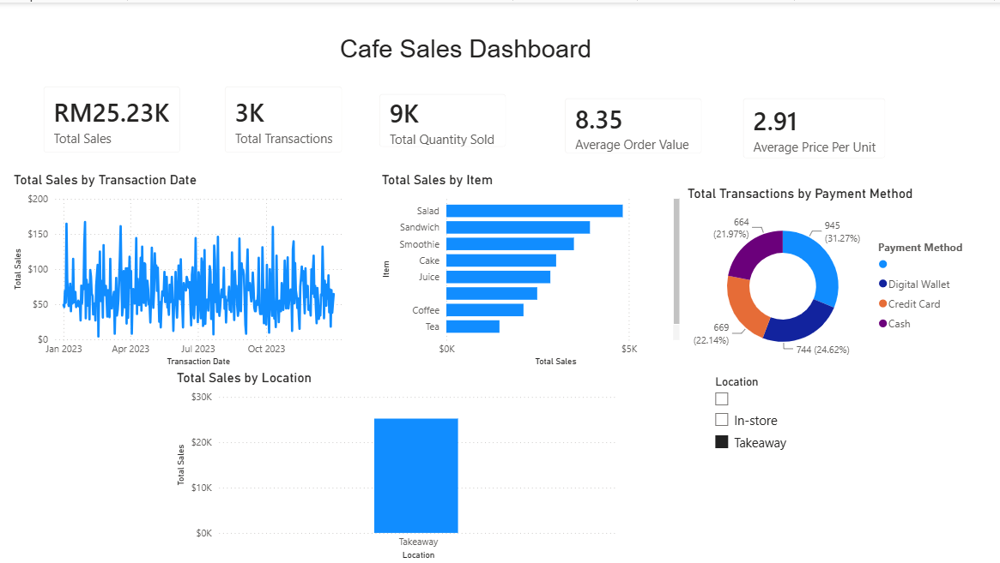

 Cafe Sales Dashboard

## 📌 Project Overview

This project analyzes café sales transactions using Power BI. The dataset was cleaned using Power Query, transformed with DAX measures, and visualized in an interactive dashboard to provide actionable business insights.

---

## 🛠️ Tools Used

- Power BI
- Power Query
- DAX
- Microsoft Excel
- GitHub

---

## 📂 Dataset

The dataset contains café transaction records including:

- Transaction ID
- Item
- Quantity
- Price Per Unit
- Total Spent
- Payment Method
- Location
- Transaction Date

---

## 🔄 Data Cleaning (Power Query)

The dataset contained several data quality issues.

Cleaning steps included:

- Removed duplicate records
- Replaced UNKNOWN values with blanks
- Replaced ERROR values with null
- Converted columns to correct data types
- Removed invalid records

---

## 📊 Dashboard Features

### KPI Cards

- Total Sales
- Total Transactions
- Total Quantity Sold
- Average Order Value
- Average Price Per Unit

### Visualizations

- Sales Trend by Date
- Sales by Item
- Sales by Location
- Payment Method Distribution

### Interactive Filters

- Location
- Payment Method
- Transaction Date

---

## 📈 DAX Measures

Measures created include:

- Total Sales
- Total Transactions
- Total Quantity Sold
- Average Order Value
- Average Price Per Unit

---

## 💡 Key Insights

- Salad generated the highest sales.
- Cash, Credit Card, and Digital Wallet transactions were distributed fairly evenly.
- Sales remained relatively stable throughout the year.
- In-store transactions contributed a significant portion of total sales.

---

## 🎯 Skills Demonstrated

- Data Cleaning
- ETL with Power Query
- Data Modeling
- DAX
- KPI Development
- Dashboard Design
- Business Intelligence
- Data Visualization

---

## 📷 Dashboard Preview

(Add your dashboard screenshot here.)

```

```

---

## 📁 Project Structure

```
Cafe-Sales-Dashboard
│
├── Data
├── Images
├── PowerBI
├── SQL
└── README.md
```

---

## 👤 Author

**Mahendran Sockalingam**
